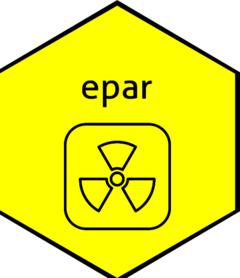
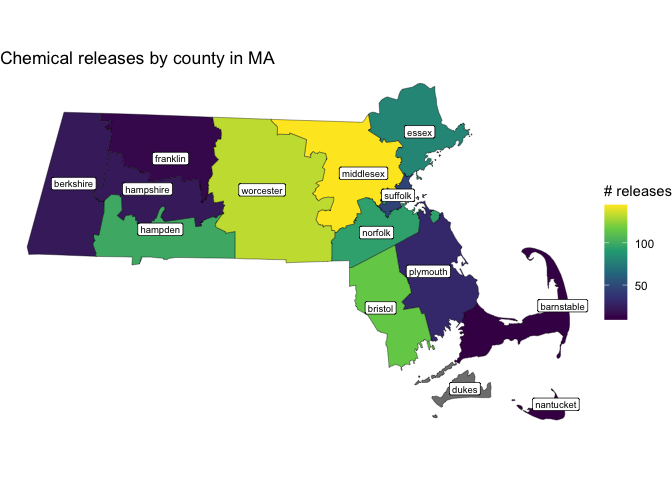

<!-- README.md is generated from README.Rmd. Please edit that file -->

# epar

<!-- badges: start -->


<!-- badges: end -->

The goal of epar is to explore chemical release data that is made
available by the Environmental Protection Agency (EPA) in their Toxics
Release Inventory (TRI). Data is reported every year by both industrial
and federal facilities, which is accessible on the EPA government
website. This data includes information on the properties of the
released chemical, relevant facility and industry characteristics, and
location of release. The epar package has tools to parse through this
data and learn more about chemical releases in a number of different
ways, including visualizations like maps and also summary statistics.

What is the top chemical release industry operating in Massachusetts,
and what percentage of those releases are carcinogenic? Which county in
Texas is responsible for the highest number of chemical releases? What
percentage of releases contain metal? These are the kinds of questions
you can answer with the epar package. If you want to write a letter to
your local policymakers about the state of industrial chemical waste in
today’s day and age, epar is for *you*.

The epar package contains example data for Massachusetts and Texas, but
users are welcome to find their own TRI data set and utilize some of
epar’s behind-the-scenes functions for cleaning before moving on to the
main summarizing and mapping functions. The world is your oyster! Feel
free to add any questions, problems, or future directions of this work
to our Issues tab above.

## Installation

You can install the development version of epar from
[GitHub](https://github.com/) with:

``` r
# install.packages("pak")
pak::pak("faithkwon/epar")
```

Important note: installed size is large (\>6.1Mb).

## Examples

This is a basic example for getting the summary statistics of two
different states for comparison:

``` r
library(epar)
compare_states(ma_2024, tx_2024)
#> Your two states are:  MA  and  TX . 
#> MA  has  820  chemical releases. 
#>  TX  has  9522 chemical releases. 
#> 42.07 % of  MA 's chemical releases are classified as hazardous by the Clean Air Act. 
#>  33.73 % of  TX 's chemical releases are hazardous. 
#> 27.8 % of  MA 's chemical releases are classified as carcinogens. 
#>  30.27 % of  TX 's chemical releases are carcinogens.
```

Another example is mapping the number of chemical releases by county:

    #> Warning in st_point_on_surface.sfc(sf::st_zm(x)): st_point_on_surface may not
    #> give correct results for longitude/latitude data



Delete this eventually: You’ll still need to render `README.Rmd`
regularly, to keep `README.md` up-to-date. `devtools::build_readme()` is
handy for this. In that case, don’t forget to commit and push the
resulting figure files, so they display on GitHub and CRAN. l
